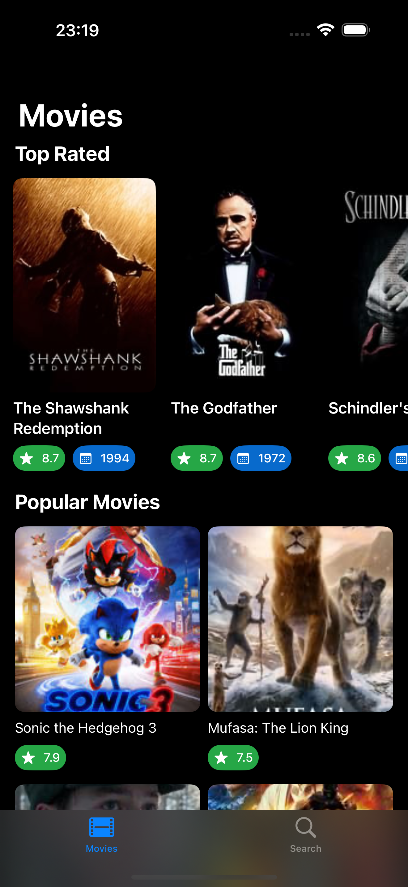
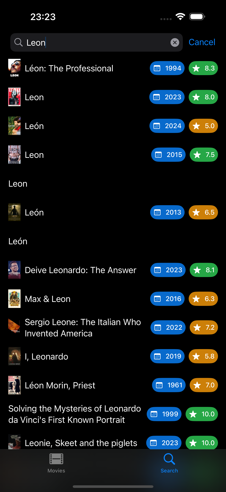
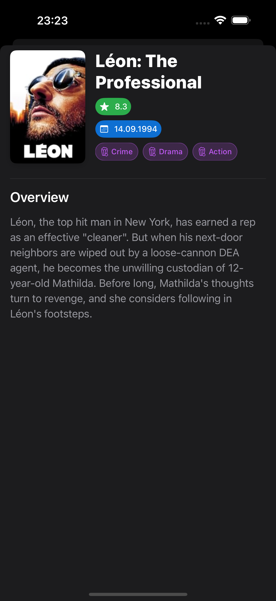
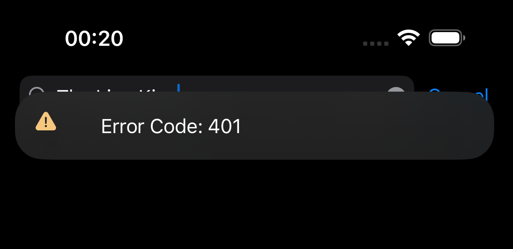
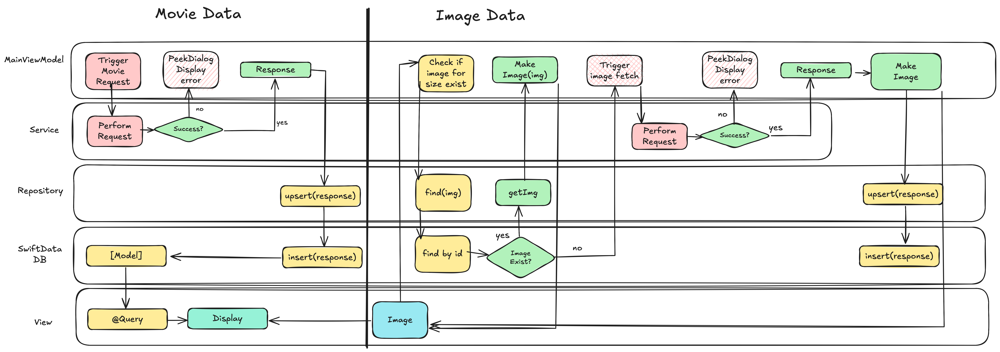

# Wallmax

A Swift application that demonstrates clean architecture principles and a flexible networking layer for interacting with movie databases like TMDB and IMDB.

<div style="display: flex; justify-content: space-around;">
  
  
  
</div>

## Disclaimer
This project was developed as part of a take-home assignment. While it fulfills all specified requirements of the assignment, it also includes additional features and concepts aimed at future-proofing the application or demonstrating ideas and principles I think is worth exploring further. To maintain readability and focus, this README does not cover every minor or mahor detail of the implementation. If you have any questions or require further clarification about specific aspects of the code, decisions feel free to reach out to me directly.

## Setup
Wallmax uses environment variables for API keys and some host strings.
In order to build it, you need to add these to your project.

### Adding Environment Variables
To be able to make request to the TMDB servers, you'll need and **API Key**. - This is your read token or your bearer token. You can obtain this by signing up with TMDB [here](https://developer.themoviedb.org).

In order to add this you will have to navigate to **Product -> Scheme -> Edit Scheme...** and select the **Arguments** tab. Here you can add values with your credentials.
Make sure your environment key is **TMDB_API_KEY**.

###### Important: 
This will prevent you from running the app without xcode. The environment values are not part of the app.
If you want to you can also set the apiKey in TMDBCLient directly. This will allow you to run the app without having to run it with xcode.

## Architecture

The project follows a clean architecture approach with the following key components:

### Core Layers

- **UI Layer**: SwiftUI views and view models
- **Repository Layer**: Data persistence and retrieval abstraction
- **Networking Layer**: API clients and services
- **Domain Layer**: Business logic and models

### Key Design Patterns

- **Protocol-Oriented**: Heavy use of protocols for abstraction and flexibility
- **Repository Pattern**: Abstracting data persistence operations
- **MVVM**: UI layer follows Model-View-ViewModel pattern
- **Dependency Injection**: Services and repositories are injected where needed

## Project Structure 

```
// Important bits of the project.

Wallmax/
├── APIClients/
│ ├── TMDBClient/
│ │ ├── TMDBClient.swift
│ │ ├── Services/
│ │ ├── Models/
│ │ └── Endpoints/
│ └── IMDBClientDemo/
├── UI/
│ ├── MainView/
│ │ ├── Components/
│ │ ├── MainView.swift
│ │ ├── MainViewModel.swift
│ │ ├── MovieView.swift
│ │ └── SearchView.swift
├── Repositories/
│ ├── Models/
│ │ └── Entities/
│ ├── MovieRepository.swift
│ ├── ImagesRepository.swift
│ └── SwiftDataRepository.swift
├── Utilities/
│ ├── Networking/
│ ├── Logging/
│ └── Extensions.swift
└── Resources/
```

## API Client Architecture

The project implements a flexible API client architecture that makes it easy to add new API integrations.

### Key Components

#### APIClient

APIClient is the building block of the API client architecture.
It just defines a network configuration of an API client to effectively build endpoints and URL requests.

```swift
protocol APIClient {
    associatedtype Configuration: NetworkConfigurable

    static var configuration: Configuration { get }
}
```

##### NetworkConfigurable Protocol

The NetworkConfigurable protocol defines the basics of an API.

```swift
protocol NetworkConfigurable {
    var apiKey: String? { get }
    var host: String? { get }
    var port: Int? { get }
    var disableSecureConnection: Bool { get }
}
```

##### Endpoint Protocol

```swift
protocol Endpoint {
    associatedtype Configuration: NetworkConfigurable

    static var basePath: String { get }
    static var clientConfiguration: Configuration { get }
    var path: String { get }
}
```

###### Usage
Here is the implementation of MoviesEndpoint using the Endpoint protocol.

```swift
enum MoviesEndpoint: Endpoint {
	case mostPopular
	case topRated
	
	static var basePath: String { "/3/movie" }
	
	static var clientConfiguration: TMDBClient.TMDBConfiguration = TMDBClient.configuration
	
	var path: String {
		switch self {
			case .mostPopular:
				return "/popular"
			case .topRated:
				return "/top_rated"
		}
	}
}
```

The builtin static extension methods are then called directly on the Endpoint.

###### For example:

```swift
    let endpoint = MoviesEndpoint.mostPopular.url()
    // OR BETTER
    let mostPopular = try await movieService.getMovies(.mostPopular)
```

We can also use the EndpointOptions protocol to provide easy query building:

###### Endpoint Options Protocol

```swift
protocol EndpointParameter {
	
	func makeQueryItem() -> URLQueryItem
}
```

To simply use it we can provide the options on the builtin `func url(with parameters: [any EndpointParameter]? = nil)`.

###### Exmple usage:
```swift
    enum MoviesOptions {
	
	/// Defaults to en-US
	case language(String)
	
	/// Defaults to 1
	case page(Int)
	
	/// ISO-3166-1 code
	case region(String)
}

extension MoviesOptions: EndpointParameter {

	func makeQueryItem() -> URLQueryItem {
		switch self {
			case .language(let value): URLQueryItem(name: "language", value: value)
			case .page(let value): URLQueryItem(name: "page", value: String(value))
			case .region(let value): URLQueryItem(name: "region", value: value)
		}
	}
}

/// USAGE:
    let url = MoviesEndpoint.topRated.url(with: [.page(2), .language(en-UK)])
```

#### Session

So far, we've explored how to create an APIClient and construct URLs using the Endpoint protocol. This setup ensures a structured and reusable approach to handling network requests.

The network layer relies on the Session actor, which acts as a wrapper around the built-in URLSession. It simplifies interceptor and retry logic. These features won't be discussed in further detail here.

###### Note: 
*Some features in the session actor have been simplified or are not actively used in this project. They are included primarily for demonstration purposes. If you have questions about specific design choices, feel free to ask.*


```swift
/// Example usage of Session
    let response = try await Session.performHttp(request)
                                .decode(as: MoviesResponse.self)
```

#### Persistence and Offline Storage

The app uses SwiftData for persistent storage with a clean repository abstraction:

- **SwiftData Integration**: Core data layer using `ModelContainer` and `ModelContext`
- **Repository Pattern**: `RepositoryProtocol` provides a clean, databse agnostic interface for CRUD operations
- **Offline First**: Most of the network responses are cached in SwiftData for offline access
- **Image Caching**: Movie posters are stored locally using `MovieImages` entity

Given the app's small scale and simplicity, the data fetched for movies is limited to the most popular and top-rated categories. These collections are relatively small and can be efficiently managed within a SwiftData container. However, images are handled differently—they are cached separately as they are displayed. During movie searches, the app only caches larger images for detail views, avoiding storage of smaller images.


## View Hierarchy and Dependency Injection

### View Hierarchy

The view hierarchy in this project is designed to provide a clean and modular structure, separating concerns effectively. Here's an overview:

1. **`MainView`**
   - Acts as the root view of the application.
   - Contains a `TabView` with two main tabs:
     - **Movies**: Displays a list of movies (top-rated and popular).
     - **Search**: Provides a search interface for movies (structure similar to `MovieView`).
   - Injects the `MainViewModel` into the SwiftUI environment for dependency sharing across child views.
   - Uses a `PeekDialog` modifier to display temporary messages (e.g., warnings or errors).

2. **`MovieView`**
   - Displays movie content, structured into two sections:
     - **Top Rated Movies**: Shown in a horizontal scroll view.
     - **Popular Movies**: Presented in a lazy grid.
   - Pull-to-refresh functionality is implemented to update the movie data.
   - Integrates with `MainViewModel` to retrieve and display movie data and poster images.

3. **`SearchView`**
   - Similar in structure to `MovieView` but tailored for displaying search results.
   - Uses `MainViewModel` to perform asynchronous search operations and display the results.

### Dependency Injection

Dependency injection is used to maintain a clear separation of concerns and facilitate testing. The main components are injected into the view hierarchy as follows:

1. **`MainViewModel`**
   - Acts as the central source of truth for the app's state and business logic.
   - Injected into the environment using the `environment` modifier in `MainView`.
   - Child views access the view model via the `@Environment` property wrapper, enabling consistent and centralized data sharing.
   - Keeps track of errors thrown from deep down and bubbles them up to the view by utilizing `peekDialog`

     - PeekDialog is a highly customizable notification style banner that supports additional features like visibility delay, swipe to dismiss, buttons, localizations and different states.

   <div style="text-align: center;">
    
  </div>


2. **Repositories**
   - The `MainViewModel` depends on repositories like `SwiftDataRepository` for data persistence.
   - These repositories are initialized with the `ModelContext`, ensuring seamless integration with SwiftData.

3. **Services**
   - Services such as `MovieService`, `ImageService`, and `SearchService` are used for network operations.
   - These are instantiated within the view model to abstract away external API calls and maintain a single point of interaction for external data sources.

This structure ensures that each view focuses solely on presentation, while the `MainViewModel` handles business logic and state management, adhering to the MVVM design pattern. Dependency injection enhances testability and modularity, allowing components to be easily swapped or mocked for testing purposes.

### App Structure

##### App Diagram

<div style="display: flex; justify-content: space-around;">
  
  </div>

##### Flow Diagram

<div style="display: flex; justify-content: space-around;">
  
  </div>

###### NOTE:
**Please note that these are high level highlights of the app and it's architecture. If you have have any questions please feel free to ask.**
